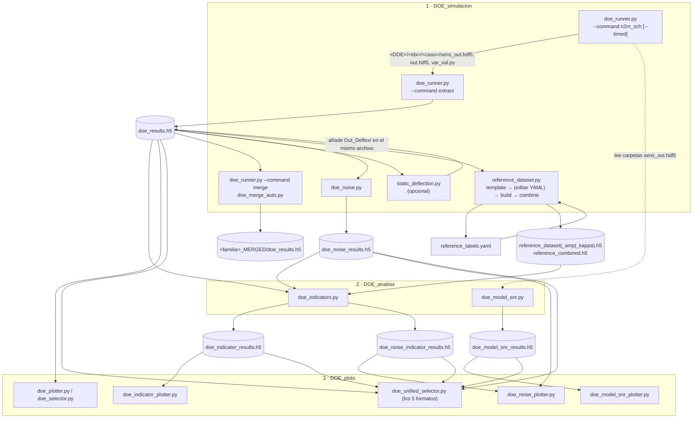

# Flujo de DOE_utils — orden de scripts, entradas y salidas

Entorno: `entorno_CAMP10\Scripts\python.exe` (salvo `doe_runner.py --command n2m_sch`, que usa el Python de Nessy2m).
El orden real lo marcan los **archivos HDF5**, no los `import` (solo `doe_merge_auto → doe_runner` y los selectores → plotters se importan entre sí).

## Diagrama

## Orden de ejecución

| # | Script | Entrada | Salida | Atributos / argumentos clave |
|---|---|---|---|---|
| 1 | `DOE_simulacion/doe_runner.py` (`n2m_sch`) | Caso Nessy2m (`--case`), `n2m.bat` | Carpeta `<DOE_NAME>/<idx>/<caso>/` con `sens_out.hdf5`, `out.hdf5`, `var_val.py` (+ `wall_time_s.txt` con `--timed`) | CONFIG: `DOE_NAME`, `DOE_MODE` (factorial/sweep/manual), `DOE_SWEEP`, `NB_PROC`. CLI: `--case`, `--doe_name`, `--timed`, `--workers`, `--auto-extract`, `--dry-run` |
| 2 | `doe_runner.py --command extract` | Carpeta del DOE | `<DOE>/doe_results.h5` | Grupos `case_NNN`, attrs `$param$`, `kappa` o `kappa_start/end`, `wall_time_s`; subgrupos `Axial_disp/vel/acc` y `res_R_p` con `{time, values}`. `AP_REF`, `DOE_EXTRACT_SIGNALS` |
| 2b | `doe_runner.py --command merge` / `doe_merge_auto.py` | Dos o más DOE (`<fam>_RUN_N`) | `doe_results.h5` fusionado; auto → `<fam>_MERGED/` | `--merge_from`, `--merge_out`; `--root`, `--dry-run`, `--self-test` |
| 3 | `static_deflection.py` (opcional) | `doe_results.h5` | Mismo archivo: `case_XXX/Out_Deflex/Axial_disp_out_deflex` y `Axial_vel_out_deflex`; attrs `deflex_theoric_m`, `force_theoric_N` | `F_TOOTH_MM`, `K_CUT`, `K_SYS`, `ALPHA_DEG`, `THETA_DEG`; `--dry-run`, `--selftest` |
| 4 | `doe_noise.py` | `doe_results.h5` | `doe_noise_results.h5`: `control`, `snr_XXX.XX` | `CONTROL_CASE_IDX`, `SNR_LIST`/`SNR_RANGE`, `SEED`, `SIGNALS`; `--list`, `--out` |
| 5 | `reference_dataset.py template` | `doe_results.h5` | `reference_labels.yaml` | `--strategy manual\|kappa\|amplitude`, `--kappa-threshold`, `--warmup`, `--base-attr`, `--base-scale`, `--amp-signal`, `--lim-inf-pct`, `--lim-sup-pct`, `--t-start`, `--t-end` |
| 5b | (a mano) | `reference_labels.yaml` | YAML corregido | Intervalos stable/unstable/gray por caso |
| 5c | `reference_dataset.py build` | `doe_results.h5` + YAML | `reference_dataset*.h5` (`/stable`, `/unstable`, `/gray` → `caso/canal__NNN/{t,y}`) | `--channels`, `--t-start`, `--t-end` (SOBRESCRIBE) |
| 5d | `reference_dataset.py combine` | `reference_dataset.h5` | `reference_combined.h5` | Solo para el visor; los indicadores ya no lo usan |
| 6 | `DOE_analisis/doe_indicators.py` | `doe_results.h5` **o** `doe_noise_results.h5` + `reference_dataset*.h5` | `doe_indicator_results.h5` **o** `doe_noise_indicator_results.h5` (`caso/run_name/{t, I_t, t_d, t_d_no_FAR}` + attrs `pp_*`, `meta_*`) | CONFIG: `RUNS`, `INDICATOR_CONFIG_*`, `_T_GT`, `USE_EXTERNAL_REFERENCE`. CLI: `--doe_results`, `--cases`, `--workers`, `--label_key`, `--list`, `--dry_run` |
| 7 | `DOE_analisis/doe_model_snr.py` | Carpetas del DOE (`sens_out.hdf5` por índice) | `doe_model_snr_results.h5` (attrs `snr_mod_dB` por señal y caso) | `DOE_NAME`, `CASE_NAME`, `CONTROL_IDX`, `BASE_DIR`; `--doe_name`, `--control_idx`, `--out`, `--list`, `--dry_run` |
| 8 | `DOE_plots/*` | Ver tabla de abajo | Figuras / ventana interactiva | — |

## Qué visualiza cada plotter

| Script | Lee | Figuras |
|---|---|---|
| `doe_plotter.py` | `doe_results.h5` | Overlay `Axial_disp`/`Axial_vel`, convergencia RMS y máximo. `--doe_name` |
| `doe_selector.py` | `doe_results.h5` | Tabla de casos + 2 subplots (importa `doe_plotter`) |
| `doe_indicator_plotter.py` | `doe_indicator_results.h5` | `t_d` vs parámetro DOE, `I_t(t)` overlay, RMS/Hilbert. `--ind_results`, `--plot-td`, `--plot-It`, `--run_name`, `--t_gt` |
| `doe_noise_plotter.py` | `doe_noise_results.h5` y `doe_noise_indicator_results.h5` | Señales con ruido, `t_d` vs SNR, lollipop, delay, costo FAR. `--noise_results`, `--indicator_results`, `--plot-all` |
| `doe_model_snr_plotter.py` | `doe_model_snr_results.h5` | SNR_mod_dB vs parámetro, overlay de señales. `--snr_results` |
| `doe_unified_selector.py` | Cualquiera de los 5 `.h5` | Ventana Tk: tabla, señales/`I_t` y resúmenes (importa los 4 plotters y `plot_style`). `--h5` |
| `plot_style.py` | — | `ARTICLE_RCPARAMS`, `FIGSIZE_SIMPLE/WIDE` (solo módulo) |

## Detalles a tener presentes
- `doe_noise.py` y `doe_indicators.py` leen `Axial_disp/Axial_vel` de `doe_results.h5`, **no** `Out_Deflex`. Según el docstring de `static_deflection.py`, solo el selector y `reference_dataset.py` leen `Out_Deflex`.
- `doe_model_snr.py` no pasa por `doe_results.h5`: lee los `sens_out.hdf5` directo de las carpetas del DOE.
- `doe_indicators.py` en modo ruido detecta el formato por los nombres de grupo (`control`/`snr_*`) y fija `label_key = snr_db`.
- Los indicadores reciben `reference_dataset*.h5` (hoy `_amp`). Los `*_NEW.py` de `indicators/*/examples` aún apuntan a un `reference_dataset.h5` que ya no existe.
