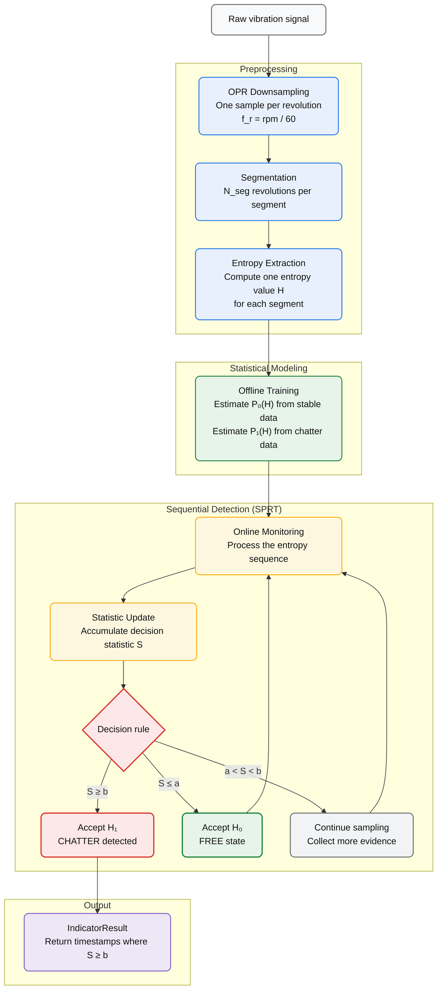

# MaxEnt-SPRT: Chatter Detection Indicator

**MaxEnt-SPRT** is a Python library that detects machining chatter *online* using two well-established statistical tools: **Maximum Entropy (MaxEnt)** modelling and **Wald's Sequential Probability Ratio Test (SPRT)**.

[Open User Guide](guide/quickstart.md){ .md-button .md-button--primary }
[Open Technical Docs](technical/index.html){ .md-button }

---

[Developer Hub](developer_hub.md){ .md-button }

---

## What is Chatter?

Chatter is a self-excited vibration that appears during machining (milling, turning, boring) when the cutting force couples with the structural dynamics of the machine–“tool–“workpiece system. It manifests as a sudden, large-amplitude oscillation that:

- Damages the tool and the workpiece surface.
- Produces a characteristic loud noise.
- Limits depth-of-cut and spindle speed.

Detecting chatter *early* — before it fully develops — allows a controller to adjust the process parameters and avoid damage.

---

## Why MaxEnt + SPRT?

| Challenge | Solution |
|---|---|
| The vibration signal changes character when chatter starts | Entropy of signal segments increases at chatter onset |
| We need to decide *online*, segment by segment | SPRT makes binary decisions sequentially with controlled error rates |
| We want to avoid false alarms | SPRT thresholds $\alpha$ (false positive) and $\beta$ (false negative) directly control error rates |
| We need a probability model for entropy values | Maximum Entropy gives the *least-biased* Gaussian PDF from observed mean/variance |

---

## Quick Installation

```bash
# From the project folder
pip install .
```

See [Installation](guide/installation.md) for details.

---
## Pipeline

The following diagram summarizes the complete detection workflow.



---
## Quick Example

```python
import numpy as np
from MaxEnt_SPRT import SignalData, run_maxent_sprt, plots_maxent_sprt

# --- Synthetic signal: stable sine (0-5 s) + high-frequency chirp (5-10 s) ---
fs = 20_000.0
t = np.arange(0, 10, 1/fs)
rng = np.random.default_rng(42)
stable  = np.sin(2 * np.pi * 200 * t[t < 5])  + rng.normal(0, 0.05, (t < 5).sum())
chatter = np.sin(2 * np.pi * (200 + 60 * t[t >= 5]) * t[t >= 5]) + rng.normal(0, 0.05, (t >= 5).sum())
signal  = np.concatenate([stable, chatter])

# --- Package the signal ---
sig = SignalData(t_analysis=t, signal_analysis=signal, fs=fs, path="synthetic")

# --- Configure the indicator ---
config = {
    "func": "Default",
    "params": {
        "rpm": 12_000.0,
        "ratio_sampling": 50.0,
        "N_seg": 2,
        "t_stable_total": 5.0,
        "alpha": 0.05,
        "beta": 0.05,
        "reset_on_H0": True,
        "cut_start_time": 0.0,
        "cut_end_time": 10.0,
    },
}

# --- Run + plot ---
result = run_maxent_sprt(sig, config)
plots_maxent_sprt(signal=sig, result=result, show_signal=True)
```

For a complete step-by-step walkthrough, see [Quick Start](guide/quickstart.md).

---

## Documentation Structure

| Section | Contents |
|---|---|
| **Theory** | MaxEnt principle, SPRT test, OPR sampling — what the math means |
| **User Guide** | Installation, Quick Start, API walkthrough, real data loading |
| **API Reference** | All classes and functions with parameters and return types |
| **Technical Documentation** | Detailed Sphinx pages for internal modules, full APIs, and developer-oriented implementation detail |

[Go To Technical Documentation](technical/index.html){ .md-button .md-button--primary }

---

## Recommended Reading Paths

### Guided Path

Short route to understand the method, run it, and find the main callable surfaces.

1. [OPR Sampling](theory/opr.md)
2. [Quick Start](guide/quickstart.md)
3. [Run & Plot](guide/run_and_plot.md)
4. [API Overview](api/index.md)

### Deep Dive Path

Longer route for implementation details, internal structure, and full generated APIs.

1. [Technical Overview](technical/overview.html)
2. [Internal Architecture](technical/architecture.html)
3. [Developer Notes](technical/developer_notes.html)
4. [Full AutoAPI Reference](technical/autoapi/index.html)

