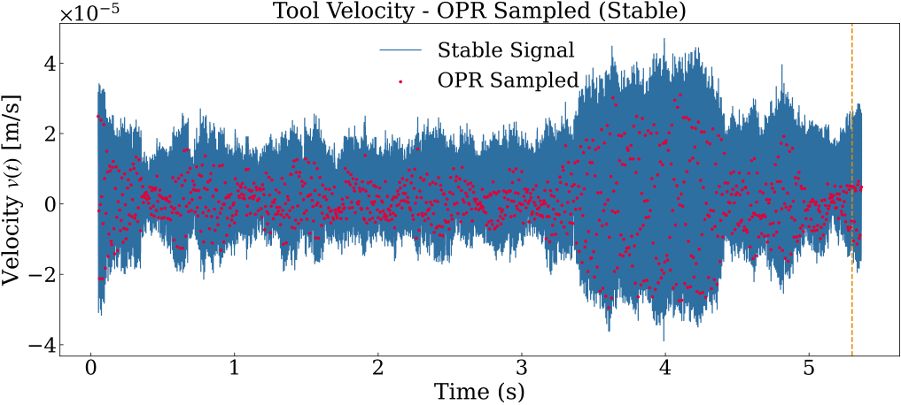
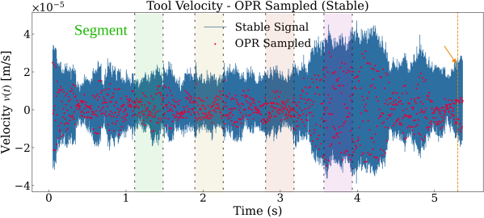

[Maximum Entropy →](maxent.md){ .md-button }
# OPR Sampling

This page explains **OPR (One-Per-Revolution) sampling** — the pre-processing step that converts the raw high-frequency vibration signal into a much smaller sequence that is synchronised with the spindle rotation.

---

## 1. Why Not Use the Raw Signal Directly?

The raw accelerometer or displacement signal is sampled at $f_s \approx 20{,}000\,\text{Hz}$. At 12 000 rpm ($f_r = 200\,\text{Hz}$) that is **100 samples per revolution**.

Processing 100 values per revolution, per segment, per test decision is:

- **Redundant**  adjacent samples are highly correlated within one revolution.
- **Slow**  entropy estimation on long windows is expensive.
- **Inconsistent**  a "segment" defined in time does not correspond to the same number of revolutions at different spindle speeds.

**OPR sampling** solves all three problems by keeping exactly **1 sample per revolution**, making the segment length physically meaningful: $N_\text{seg}$ OPR samples = $N_\text{seg}$ revolutions = $N_\text{seg}/f_r$ seconds.

---

## 2. How OPR Sampling Works

OPR sampling is a **uniform downsample** by an integer factor [Figure 1](#fig-opr):

$$\text{step} = \frac{f_s}{f_r} = \frac{f_s \cdot 60}{\text{rpm}}$$

The downsampled signal is:

$$y_\text{OPR}[k] = y\!\left[k \cdot \text{step}\right], \quad k = 0, 1, 2, \ldots$$



<p align="center"><strong>Figure 1.</strong> Velocity sampling procedure employed for estimating the OPR.</p>
<a id="fig-opr"></a>

!!! note "Integer requirement"
    `sample_opr()` raises `ValueError` if $f_s / f_r$ is not an integer.  
    Make sure $f_s$ is chosen so that $f_s \bmod f_r = 0$.

### Example

| Parameter | Value |
|---|---|
| $f_s$ | 20 000 Hz |
| rpm | 12 000 → $f_r = 200$ Hz |
| step | $20000 / 200 = 100$ |
| OPR sampling rate | 200 Hz (one sample per revolution) |

The signal goes from 20 000 Hz to 200 Hz — a **100 — reduction** without losing the per-revolution structure.

---

## 3. The `ratio_sampling` Parameter

In the `INDICATOR_CONFIG`, `ratio_sampling` controls a **second downsampling** applied on top of OPR:

$$f_\text{effective} = \text{ratio-sampling} \times f_r$$

With `ratio_sampling = 50` and $f_r = 200\,\text{Hz}$:

$$f_\text{effective} = 50 \times 200 = 10{,}000\,\text{Hz}$$

This gives an intermediate rate between raw $f_s$ and pure OPR, useful when $f_s/f_r$ is very large. Set `ratio_sampling = 1` to use pure OPR (1 sample/rev).

---

## 4. Segmentation

After OPR sampling, the sequence is split into **non-overlapping segments** of $N_\text{seg}$ samples [Figure 2](#fig-segmentation).


```
OPR samples:  o o o o | o o o o | o o o o | ...
              segment 0  segment 1  segment 2
```




<p align="center"><strong>Figure 2.</strong> Example of segmentation of velocity-based OPR samples into non-overlapping segments..</p>
<a id="fig-segmentation"></a>

Each segment:

| Property | Value |
|---|---|
| Number of OPR samples | $N_\text{seg}$ |
| Physical duration | $N_\text{seg} / f_r$ seconds |
| Revolutions covered | $N_\text{seg}$ |
| Assigned timestamp | Midpoint of the segment's time array |

A small $N_\text{seg}$ (e.g. 2) gives finer time resolution but noisier entropy estimates.  
A large $N_\text{seg}$ (e.g. 10–“20) gives smoother estimates but slower temporal response.

---

## 5. In Code

```python
from MaxEnt_SPRT.utils.opr import sample_opr, segment_opr

# OPR downsampling
opr_signal, opr_time = sample_opr(y=raw_signal, t=t, fs=20_000.0, fr=200.0)

# Segmentation into groups of N_seg revolutions
segments, segments_t = segment_opr(opr=opr_signal, opr_t=opr_time, N_seg=2)

# segments[i] is an array of N_seg OPR values
# segments_t[i] is the corresponding time array
print(len(segments))           # total number of segments
print(segments[0].shape)       # (N_seg,)
```

These utilities are called internally by `run_maxent_sprt()` — you do not need to call them directly unless you want custom control.

---

## 6. Summary

| Concept | Symbol / Param | Meaning |
|---|---|---|
| OPR sampling rate | $f_r = \text{rpm}/60$ | Revolutions per second |
| Downsample step | $f_s / f_r$ | Keep every N-th sample |
| Second downsampling | `ratio_sampling` | Fine-tune effective rate |
| Segment length | `N_seg` | OPR samples per entropy estimate |
| Segment time span | $N_\text{seg}/f_r$ | Physical duration (seconds) |

[Maximum Entropy →](maxent.md){ .md-button }

