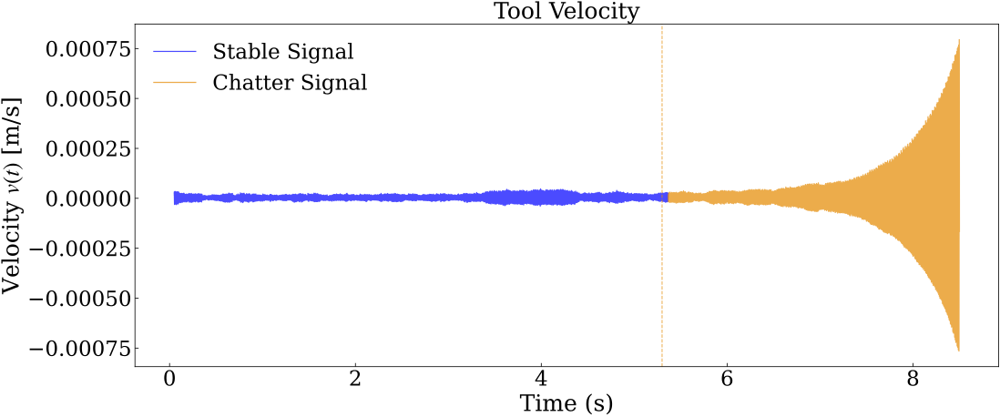
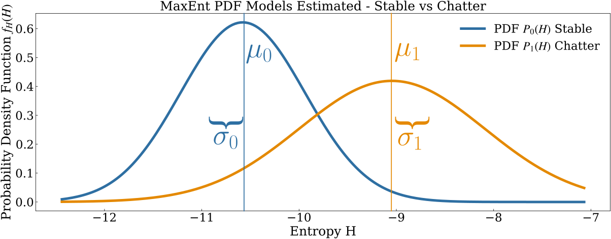
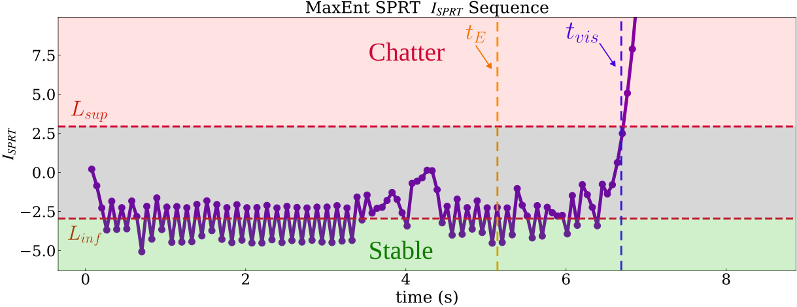
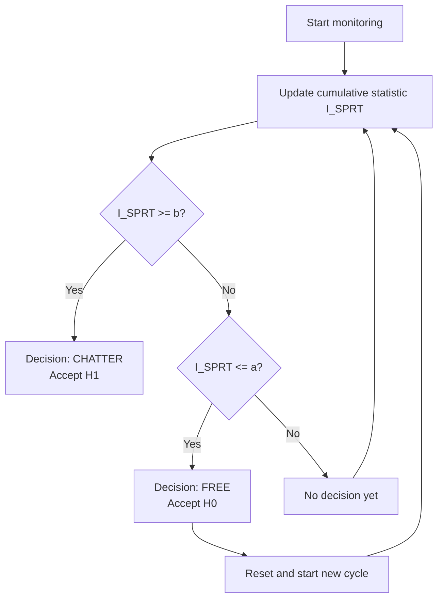

[← Maximum Entropy](maxent.md){ .md-button }   [Installation →](../guide/installation.md){ .md-button }
# Sequential Probability Ratio Test (SPRT)

This page explains how the **SPRT** makes a binary chatter/no-chatter decision from the entropy sequence $\{H_n\}$ computed in the previous stage.

---

## 1. The Decision Problem
We considere this example:




<p align="center"><strong>Figure 1.</strong> Illustration of the velocity sampling strategy used in the estimation of the Operational Parameter Ratio (OPR)..</p>

<a id="fig-opr"></a>
After training we have two probability models:

- $\textcolor{blue}{P_{0}}(H)$: entropy PDF under *normal* (chatter-free) conditions.
- $\textcolor{orange}{P_{1}}(H)$: entropy PDF under *chatter* conditions.




<p align="center"><strong>Figure 1.</strong> Illustration of the velocity sampling strategy used in the estimation of the Operational Parameter Ratio (OPR)..</p>

<a id="fig-psd-models"></a>

For every new segment $n$ we observe entropy $H_n$ and must decide:

$$H_0: \text{no chatter} \quad \text{vs.} \quad H_1: \text{chatter}$$

A simple threshold on $H_n$ alone would require a large $H_n$ to be confident. The **SPRT** instead *accumulates evidence* across segments — it becomes confident faster.

---

## 2. Log-Likelihood Ratio (LLR)

For each observation $H_n$, the **log-likelihood ratio** is:

$$
\ln \Lambda(H_{\mathrm{seg},n})
= \ln\frac{\textcolor{orange}{P_1}(H_{\mathrm{seg},n})}
                  {\textcolor{blue}{P_0}(H_{\mathrm{seg},n})},
$$

- $\Lambda_n > 0$: this observation is more consistent with **chatter** ($P_1$).
- $\Lambda_n < 0$: this observation is more consistent with **no chatter** ($P_0$).

For Gaussian models the LLR has a closed-form expression. With $P_i = \mathcal{N}(\mu_i, \sigma_i^2)$:

$$\ln\Lambda_n = \ln\frac{\sigma_0}{\sigma_1} + \frac{(H_n - \mu_0)^2}{2\sigma_0^2} - \frac{(H_n - \mu_1)^2}{2\sigma_1^2}$$

---

## 3. The SPRT Accumulator

Wald's SPRT keeps a **running sum** $S_n$:

$$\textcolor{purple}{I_{\mathrm{SPRT}}}(0) = 0, \qquad \textcolor{purple}{I_{\mathrm{SPRT}}}(n)
= \textcolor{purple}{I_{\mathrm{SPRT}}}(n-1)
+ \log \Lambda(H_{\mathrm{seg},n}),$$

Think of $S_n$ as a bank account: each segment deposits or withdraws evidence. When the account reaches a **threshold**, a decision is made.

---

## 4. Decision Thresholds

The thresholds are derived from the desired error rates:

| Error type | Symbol | Meaning |
|---|---|---|
| Type I (false alarm) | $\alpha$ | P(decide chatter \| no chatter) |
| Type II (missed detection) | $\beta$ | P(decide no chatter \| chatter) |

Wald showed that the optimal thresholds are:

$$a = \ln\frac{\beta}{1-\alpha} \quad (\text{lower, accept } H_0) \qquad b = \ln\frac{1-\beta}{\alpha} \quad (\text{upper, accept } H_1)$$

With $\alpha = \beta = 0.05$:

$$a = \ln\frac{0.05}{0.95} \approx -2.94 \qquad b = \ln\frac{0.95}{0.05} \approx +2.94$$

---

## 5. Decision Rule

At each step:

$$
\begin{aligned}
\textcolor{purple}{I_{\mathrm{SPRT}}}(n) &\ge b 
&\;\Rightarrow\;& \text{Chatter detected (accept } \textcolor{orange}{H_{1}}\text{)} \\
\textcolor{purple}{I_{\mathrm{SPRT}}}(n) &\le a 
&\;\Rightarrow\;& \text{Free state (accept } \textcolor{blue}{H_{0}}\text{)} \\
& &\;\Rightarrow\;& \text{Continue sampling (otherwise)}
\end{aligned}
$$

When `reset_on_H0 = True`, $\textcolor{purple}{I_{\mathrm{SPRT}}}(n)$ is reset to 0 every time $\textcolor{blue}{H_{0}}$ is accepted — this allows the detector to re-arm itself and catch *multiple* chatter events in the same signal.




<p align="center"><strong>Figure 1.</strong> Illustration of the velocity sampling strategy used in the estimation of the Operational Parameter Ratio (OPR)..</p>

<a id="fig-opr"></a>

---

## 6. Visual Interpretation



- The statistic drifts near zero while the signal is stable.
- When chatter starts, $\ln\Lambda_n > 0$ on average and $S_n$ rises toward $b$.
- Once $\textcolor{purple}{I_{\mathrm{SPRT}}}(n) \geq b$, chatter is flagged at the corresponding time.

---

## 7. In Code

The detector's SPRT logic is encapsulated in `SequentialProbabilityRatioTest`:

```python
from MaxEnt_SPRT import SPRTConfig, SequentialProbabilityRatioTest, GaussianIndicatorLLR

sprt_cfg = SPRTConfig(alpha=0.05, beta=0.05, reset_on_H0=True)
llr_model = GaussianIndicatorLLR(p0=detector.models.p0, p1=detector.models.p1)
sprt = SequentialProbabilityRatioTest(llr_model=llr_model, config=sprt_cfg)

result = sprt.run(H_sequence)
print(result.final_state)     # "chatter" or "free" or "indeterminado"
print(result.S_history)       # array of S_n values
print(result.b)               # upper threshold
```

In practice you never need to call this manually — `run_maxent_sprt()` handles it internally.

---

## 8. Comparison with Simple Threshold Methods

| Property | Simple threshold on $H_n$ | SPRT |
|---|---|---|
| Uses past evidence | No | Yes — accumulates $\ln\Lambda_n$ |
| Error rate control | No direct control | Exact: set $\alpha, \beta$ |
| Sensitivity | Requires large $H_n$ | Detects small, sustained changes |
| Multi-event detection | Possible with hysteresis | Built-in via `reset_on_H0` |

---

## Summary

| Symbol | Meaning |
|---|---|
| $\ln\Lambda_n$ | LLR for segment $n$: positive = evidence for chatter |
| $\textcolor{purple}{I_{\mathrm{SPRT}}}(n)$ | Cumulative LLR (the "test statistic") |
| $a$ | Lower threshold — accept $H_0$ (no chatter), derived from $\beta/(1-\alpha)$ |
| $b$ | Upper threshold — accept $H_1$ (chatter), derived from $(1-\beta)/\alpha$ |
| `reset_on_H0` | Whether to reset $S_n$ to 0 after accepting $H_0$ |

[← Maximum Entropy](maxent.md){ .md-button }   [Installation →](../guide/installation.md){ .md-button }
