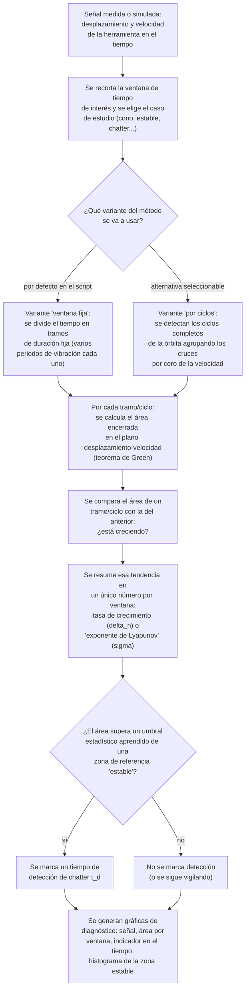

# Flujo explicativo — Método del Área de Green (Green Integral)

Explicación del proceso a nivel de problema físico/de ingeniería, sin
jerga de implementación. Pensada para entender **qué** hace el método y
**por qué**, no cómo está programado.

## El problema que resuelve

Durante el fresado, la herramienta puede entrar en "chatter" (vibración
autoexcitada) cuando las condiciones de corte se vuelven inestables. El
chatter deja una marca característica en la trayectoria de la herramienta
en el plano desplazamiento–velocidad (el "retrato de fase"): en corte
estable, esa trayectoria dibuja una órbita cerrada de tamaño más o menos
constante ciclo tras ciclo; cuando aparece chatter, la órbita empieza a
**crecer** de un ciclo al siguiente, como una espiral que se abre.

El método del Área de Green usa precisamente esa idea: mide el área
encerrada por la trayectoria en el plano desplazamiento–velocidad en
ventanas sucesivas de tiempo, y vigila si esa área **crece** de forma
sostenida. Un área que crece es la firma de una vibración que se está
amplificando — chatter.

## Paso a paso del proceso

## Las dos variantes, en términos simples

- **Ventana fija** (la que usa el script por defecto): se trocea el
  tiempo en pedazos de duración fija (p. ej. "4 vueltas de husillo" cada
  uno) y en cada pedazo se mide el área de la órbita completa, sin
  preocuparse de dónde empieza o termina exactamente un ciclo de
  vibración. Es más simple y más robusta cuando la vibración no es
  perfectamente periódica. De la secuencia de áreas se calcula un
  "exponente de crecimiento" (σ̂, análogo al exponente de Lyapunov de la
  teoría de sistemas dinámicos): positivo y sostenido significa que la
  órbita se está expandiendo (chatter).

- **Por ciclos** (agrupación / clustering): en vez de trocear por tiempo
  fijo, se identifican los ciclos reales de la órbita (usando los
  instantes en que la velocidad pasa por cero) y se mide el área de cada
  ciclo individual. Esto da una medida más "fina" y ligada a la física del
  ciclo de vibración, a costa de ser más sensible a cómo se detectan esos
  cruces. De la secuencia de áreas por ciclo se deriva `delta_n`, una tasa
  de cambio logarítmico entre ciclos consecutivos: negativa indica que el
  área crece (chatter), por convención de signo del propio indicador.

  **Importante para quien vaya a usar esta variante**: en el estado
  actual del código, esta segunda variante **no puede ejecutarse** cuando
  se invoca desde la interfaz común que comparte con los demás
  indicadores del proyecto (MaxEnt-SPRT, RMS-CV, SSQ) — el programa se
  detiene con un error antes de devolver el resultado. Ejecutada por su
  cuenta (sin pasar por esa interfaz común), sí llega a producir un
  resultado. Ver `AUDITORIA.md`, hallazgo 3.1.1, para el detalle técnico.

## El umbral de detección (μ±zσ)

Ambas variantes comparten la misma idea para decidir "cuándo" declarar
chatter: se observa el área durante un tramo de tiempo que se sabe
**estable** (definido por el usuario al configurar el caso de estudio), se
calcula su media (μ) y su dispersión (σ) en escala logarítmica, y se fija
un umbral en μ + z·σ (con z=3 en el script, equivalente a un criterio de
"3 sigma"). En cuanto el área de una ventana posterior supera ese umbral,
se marca el primer instante como tiempo de detección `t_d`. Este mismo
principio estadístico (media + z desviaciones estándar sobre una región de
referencia) es el que comparten los otros indicadores del proyecto
(MaxEnt-SPRT, RMS-CV, SSQ), lo que permite comparar sus tiempos de
detección de forma homogénea.

## Qué produce al final

El script imprime en consola un resumen (número de ventanas analizadas,
valor medio del indicador, si el resultado se interpreta como estable o
inestable, y el tiempo de detección si lo hay) y genera una serie de
gráficas: la señal original marcada en tramos estable/chatter, el área por
ventana con las líneas del umbral estadístico, el indicador (σ̂ o
`delta_n`) a lo largo del tiempo, y (si hay suficientes datos de
referencia) un histograma de las áreas de la zona estable con la curva
gaussiana ajustada y las líneas μ±3σ superpuestas.
