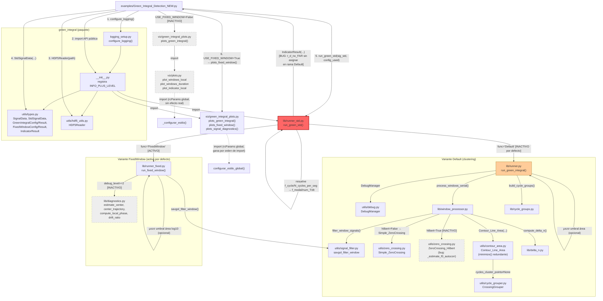

# Flujo técnico — `Green_Integral_Detection_NEW.py`

Grafo de dependencias real (imports/llamadas), en orden de ejecución.
Los nodos marcados con **[INACTIVO]** solo se alcanzan si se cambia la
configuración por defecto del script (`USE_FIXED_WINDOW=True`,
`hilbert=False`, `debug_level<2`, `t_theorical` provisto).

## Notas sobre el grafo

- **Nodo rojo** (`runner_std.py`): contiene el bug crítico §3.1.1 de
  `AUDITORIA.md` — la rama `Default` de `run_green_std` no puede
  completar su `return` sin lanzar una excepción.
- **Nodo naranja** (`runner.py`, variante Default): alcanzable hoy solo si
  se cambia `USE_FIXED_WINDOW=False` en el script de entrada; forma parte
  del flujo real (está importado y es seleccionable con una constante),
  por lo que se auditó con el mismo nivel de detalle que la ruta activa.
- **Nodos grises punteados**: código alcanzable solo bajo configuraciones
  no usadas por el script de entrada tal como está (`hilbert=True`,
  `debug_level>=2`, o la rama `USE_FIXED_WINDOW=False` de los propios
  gráficos). Se auditaron igualmente por formar parte del árbol de
  dependencias real del archivo de entrada.
- `utils/types.py` y `utils/hdf5_utils.py` son dependencias compartidas por
  prácticamente todos los módulos del paquete (se omiten flechas repetidas
  hacia ellos desde cada consumidor para no saturar el diagrama).
